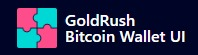

<div align="center">
  <a href="https://goldrush.dev/products/goldrush/"  target="_blank" rel="noopener noreferrer">
    
  </a>
  <br />

[](https://github.com/covalenthq/goldrush-bitcoin-wallet-ui/blob/main/LICENSE)
[](https://github.com/covalenthq/goldrush-bitcoin-wallet-ui/commits/master)
[](https://github.com/covalenthq/goldrush-bitcoin-wallet-ui/graphs/contributors)
[](https://github.com/covalenthq/goldrush-bitcoin-wallet-ui/issues)
[](https://github.com/covalenthq/goldrush-bitcoin-wallet-ui/pulls)
[](https://github.com/covalenthq/goldrush-bitcoin-wallet-ui/stargazers)
[](https://github.com/covalenthq/goldrush-bitcoin-wallet-ui/network/members)

</div>

<br/>

<h1 align="center">Bitcoin Wallet & Portfolio UI template.</h1>

<div align="center">
Powered by <span><a href="https://github.com/covalenthq/goldrush-kit">GoldRush Kit.</a></span> Open-source. Customizable.
</div>

## Ready-to-use customizable template

<a href="https://goldrush-bitcoin-wallet-ui.vercel.app/">View live template</a>

## One-click Deploy

[](https://vercel.com/new/clone?repository-url=https%3A%2F%2Fgithub.com%2Fcovalenthq%2Fgoldrush-bitcoin-wallet-ui&env=NEXT_PUBLIC_GOLDRUSH_API_KEY&envDescription=Visit%20Covalent%20to%20sign%20up%20for%20an%20API%20key&envLink=https%3A%2F%2Fwww.covalenthq.com%2Fplatform%2Fauth%2Fregister%2F)

## Creating your own GoldRush Bitcoin Wallet & Portfolio UI

The GoldRush Bitcoin Wallet & Portfolio UI is a Template Repository. It can be cloned and modified as per different specific use cases.

1.  **Fork Repository**: Fork the repository either by clicking the `Use this template` at the top of the repository or clicking [here](https://github.com/new?owner=covalenthq&template_name=goldrush-bitcoin-wallet-ui&template_owner=covalenthq)

2.  **Setup**:

    1. Install package dependencies using `npm install`.

    2. Create [.env.local](./env.local) in your root directory and add your [GoldRush API Key](https://goldrush.dev/platform/apikey). Refer to [.env.example](./.env.example) for the a list of all the environmental variables used.

    > Only the `NEXT_PUBLIC_GOLDRUSH_API_KEY` environmental key is mandatory.

    ```
    NEXT_PUBLIC_GOLDRUSH_API_KEY = "<YOUR_API_KEY>"
    ```

    3. To run the development server, type the following into your terminal.

    ```
    npm run dev
    ```

3.  **Deployment**: Once forked, a use specific can be created. The **GoldRush Bitcoin Wallet & Portfolio UI** is powered on the frontend completely using NextJS. Natively, the it is deployed on [Vercel](https://vercel.com/), however any other deployment or server hosting tools such as Netlify, AWS, DigitalOcean can be used.

## Customizing the Deployment

The forked deployment can be customized for every deployment using the [GoldRush Config File](./goldrush.config.ts). The config file exports TypeScript powered const `goldrushConfig`. By default the config file will look like this

```ts
import { type GRKKitType } from "@/utils/types/shared.types";

export const GRKKit: GRKKitType = {
  brand: {
    title: "GoldRush",
    subtitle: "Bitcoin Wallet & Portfolio UI",
    logo_url: "/goldrush-logo.png",
    github: "https://github.com/covalenthq/goldrush-bitcoin-wallet-ui",
  },
  theme: {
    borderRadius: 6,
    colors: {
      dark: {
        primary: "#FF4C8B",
        background: "#000426",
        foreground: "#FFFFFF",
        secondary: "#868E96",
      },
      light: {
        primary: "#FF4C8B",
        background: "#FFFFFF",
        foreground: "#1C2024",
        secondary: "#868E96",
      },
    },
    mode: "light",
  },
};

export default GRKKit;
```

1. **brand**: This is the customization of the `nav` bar that is rendered at the top of every page. It looks this by default

    

    1. **title**: It is the first line of your brand. By default, it is set as `GoldRush`.
    2. **subtitle**: It is the second line of your brand. By default, it is set as `Bitcoin Wallet & Portfolio UI`.
    3. **logo_url**: It is the logo of your brand. By default, it is renders the GoldRush Logo. An image src of 40x40px is recommended for this.
    4. **github**: It is the GitHub URL of your repository.

2. **theme**: This is an extension of the theme config passed to the [GoldRush Kit](https://github.com/covalenthq/goldrush-kit). Explore these theme settings from [here](https://goldrush-kit.vercel.app/?path=/story/theme-config--theme-config).

## Features

1. Real-time Wallet Details: Provides up-to-date information on bitcoin transactions, and balances in real time, giving users the latest data.
2. Ready-to-use customizable template: Jumpstart your dApp journey with a beautifully designed UI that’s both intuitive and engaging.
3. HD and Non-HD Address Support: Supports both HD and Non-HD bitcoin addresses.
5. UI Template: The GoldRush Bitcoin Wallet & Portfolio UI can be customized with different colors and modes per deployment.

## Contributing

Contributions, issues and feature requests are welcome!
Feel free to check [issues](https://github.com/covalenthq/goldrush-bitcoin-wallet-ui/issues) page.

## Show your support

Give a ⭐️ if this project helped you!

## License

This project is [MIT](./LICENSE) licensed.
